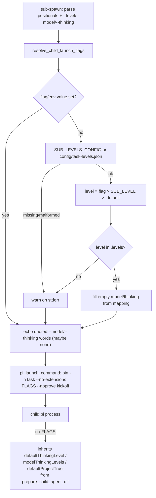

# Design: per-task difficulty levels for child model and thinking (sub-spawn)

## Summary

The orchestrator evaluates a task's difficulty when it writes the brief and
passes one of three levels to the spawn; the level maps to the child's
model and thinking level. The mapping is **configuration, not code**: it
lives in `config/task-levels.json`, local to the ai-commander checkout,
seeded with the orchestrator's initial defaults:

| Level | For | Model | Thinking |
|---|---|---|---|
| `easy` | chores, trims, config/docs edits | `opencode-zen-free/mimo-v2.6-flash-free` | `medium` |
| `standard` (default) | features/bug fixes, full specs+TDD flow | `opencode-zen-free/mimo-v2.6-flash-free` | `xhigh` |
| `hard` | architecture, root-cause, long-haul work | `opencode-go/deepseek-v4.1-flash` | `xhigh` |

Retuning the trade-off (e.g. moving a model, changing a thinking cap) is a
JSON edit, no script change.

Resolution precedence, implemented by `resolve_child_launch_flags()` in
`scripts/_sub-common.sh`:

```
model/thinking = --model/--thinking flag  >  SUB_MODEL/SUB_THINKING env
                 >  level mapping in the config
level          = --level flag  >  SUB_LEVEL env  >  config "default"
config path    = SUB_LEVELS_CONFIG env  >  <repo>/config/task-levels.json
```

Every failure mode degrades to **no flags** — the child then inherits
`defaultThinkingLevel` / `modelThinkingLevels` / `defaultProjectTrust` from
the global pi settings, which `prepare_child_agent_dir` now inherits (the
one-line key-set extension of the mechanism introduced by
`specs/child-model-defaults`). Nothing in the resolution path may break
spawning: missing file, unknown level, malformed JSON all warn on stderr,
exit 0, and print nothing.

## Entities

- **`config/task-levels.json`** (new) — `{default, levels: {<name>:
  {description, model, thinking}}}`; the three initial levels above.
  Local to this repository by requirement; overridable per environment via
  `SUB_LEVELS_CONFIG`.
- **`scripts/_sub-common.sh`** (modified):
  - `_SUB_COMMON_DIR` — script's own dir, anchors the default config path;
  - `resolve_child_launch_flags <level> <model> <thinking>` — the precedence
    walk above; echoes already-`%q`-quoted option words (possibly empty),
    warns via `warn()` to stderr, always exits 0;
  - `pi_launch_command <bin> <task> <flags> <kickoff>` — assembles the child
    launch line; with flags it is
    `bin -n task --no-extensions --model … --thinking … --approve kickoff`,
    i.e. options stay **before** the kickoff positional so pi parses them as
    options, not prompt text;
  - `prepare_child_agent_dir` — `model_cfg` jq gains
    `defaultThinkingLevel`, `modelThinkingLevels`, `defaultProjectTrust`
    (nulls still dropped, all defensive fallbacks unchanged).
- **`scripts/sub-spawn.sh`** (modified) — parses `--level <name>`,
  `--model <pattern>`, `--thinking <level>` anywhere after the script name
  (interleaved with the three positionals; unknown options die), resolves
  the flags immediately after parsing (so warnings precede any work), passes
  them through `pi_launch_command`, and prints the resolved launch options
  in the spawn handles. Usage line updated.
- **`specs/child-task-levels/`** (new) — this design + the feature file.
- **`tests/task-levels.test.sh`** (new) — one test per scenario
  [REQ-1]…[REQ-11]; hermetic (fixture configs via `SUB_LEVELS_CONFIG`,
  fixture `$HOME` for the inheritance test, env overrides cleared with
  `env -u`).
- **`AGENTS.md`** — "Child model and thinking levels" subsection: the rubric
  for picking a level, the spawn syntax, and the override knobs.

## Behaviour and data flow



## Proposed changes (files/modules)

| File | Change |
|---|---|
| `config/task-levels.json` | new — three initial levels + `default` |
| `scripts/_sub-common.sh` | `_SUB_COMMON_DIR`, `resolve_child_launch_flags`, `pi_launch_command`, thinking/trust keys in `model_cfg` |
| `scripts/sub-spawn.sh` | flag parsing, resolution call, launch-line builder, handles line, usage/comment updates |
| `specs/child-task-levels/*` | feature file + this design |
| `tests/task-levels.test.sh` | behavioural suite, one test per scenario |
| `AGENTS.md` | "Child model and thinking levels" subsection |

## Task list

- [x] Deduce atomic requirements from the brief → [REQ-1]…[REQ-11]
- [x] Write the feature file and this design doc
- [x] RED: run the new suite against the pre-change implementation
- [x] GREEN: full suite (`task-levels`, `sub-common`) + shellcheck + `bash -n` pass
- [x] Note: `specs/child-model-defaults` speaks of "the three model keys";
      its set now extends to six (three model defaults +
      `defaultThinkingLevel`, `modelThinkingLevels`, `defaultProjectTrust`).
      Its feature file and tests stay valid (its fixtures declare none of the
      new keys) — the superset behaviour is asserted here under [REQ-8].

## Strengths / Weaknesses

- **Strengths**: difficulty tuning is a JSON edit; every degradation path
  converges on "inherit from global settings", so spawning never breaks;
  the resolver is a pure function (testable without tmux/treehouse); flag
  parsing rejects typos before any resource is touched.
- **Weaknesses**: `sub-spawn.sh`'s flag parsing itself is only covered by
  the [REQ-10] bad-invocation smoke tests (happy-path wiring is asserted at
  the `pi_launch_command` level, not end-to-end — a real spawn would lease a
  worktree); the config path convention (`config/task-levels.json` next to
  `scripts/`) is implicit in `_SUB_COMMON_DIR`, so moving the scripts dir
  silently changes the default path (mitigated by `SUB_LEVELS_CONFIG`).
