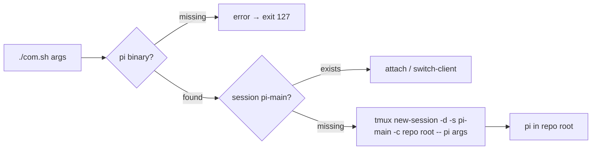

# com.sh design

`com.sh` is the successor of `pi.sh`, the root-level interactive launcher for
pi. The key inversion: `pi.sh` *refused* the reserved names `pi-main` / `pi-*`
so it could never collide with the orchestrator; `com.sh` deliberately targets
`pi-main`, because its whole purpose is to put the user into that exact
durable session. It is a thin process boundary around tmux and must stay
usable standalone — it does not source `scripts/_sub-common.sh`, does not
arrange layouts, and does not verified-send prompts.

## Behaviour

- `PI_BIN` wins when set (resolved through `command -v`, so a bare name works
  too); otherwise the first `pi` on `PATH`. Nothing found → a clear message on
  stderr and exit 127 **before** tmux is called ([REQ-6], [REQ-7]).
- Missing session → `tmux new-session -d -s pi-main -c <repo root> -- pi
  <args>`; the session is rooted at the directory containing `com.sh` (the
  repository root), and extra arguments reach pi with their boundaries
  preserved ([REQ-1], [REQ-2]).
- Existing session → never a second pi, just a hand-off ([REQ-3]).
- Hand-off: `exec tmux switch-client` when `$TMUX` is set (a nested
  `attach-session` would be refused), `exec tmux attach-session` otherwise
  ([REQ-4], [REQ-5]). Exact `=pi-main` targets avoid tmux prefix matching.

## Relation to scripts/start-main.sh (coexists, untouched)

`start-main.sh` is the orchestrator's authoritative launcher: it roots the
session at the *main checkout* even from a linked worktree, applies the
`main-vertical` / `main-pane-width 50%` layout, and boots pi through the
verified `tmux_send_line`. `com.sh` is the human-facing shortcut: create the
session if absent, run pi in it directly, attach/switch. Whichever runs first
creates `pi-main`; the other attaches to it without restarting anything
([REQ-3]), so the two can never fight. Unlike `start-main.sh`, `com.sh` roots
the session at its own checkout — it is not part of the orchestration
machinery and deliberately avoids git/main-checkout resolution to stay a
one-file launcher.

## Files

| Change | File |
|---|---|
| new | `com.sh` (executable, bash, `set -euo pipefail`, shellcheck-clean) |
| removed | `pi.sh` (superseded) |
| renamed + rewritten | `specs/pi-sh-tmux-wrapper/` → `specs/com-sh-launcher/` |
| renamed + rewritten | `tests/test-pi-sh.sh` → `tests/test-com-sh.sh` |

## Audit notes (code-auditor, post-implementation)

No major improvements detected; the launcher is a leaf module whose ~35
lines hide four behaviours behind one command. Less valuable improvements,
recorded and deliberately not applied:

- The `:` no-op branch could be written as `if ! tmux has-session …; then
  tmux new-session …; fi` — cosmetically flatter, behaviourally identical
  (kept the proven `pi.sh` shape for review familiarity).
- The pi-resolution block partially overlaps `_sub-common.sh`'s `PI_BIN`
  default + `need` check. Sharing it would mean sourcing orchestration
  internals (MAIN_SESSION, SCRATCH_DIR, …) into a standalone human-facing
  launcher to save ~6 lines — rejected: com.sh's standalone-ability is a
  requirement, and the two launchers deliberately differ (verified send and
  layout vs. direct `new-session -- pi`).
- The error message does not distinguish "PI_BIN set but unusable" from
  "no pi on PATH"; echoing the attempted value would aid debugging at the
  cost of a slightly wider interface.

## Test plan

Each `[REQ-n]` scenario has one assertion block in `tests/test-com-sh.sh`.
Tests put logging fakes for `tmux` and `pi` first on `PATH` and inspect the
recorded calls, so no real session is ever created; [REQ-7]'s "no pi on PATH"
half runs with a fully controlled `PATH` containing only the fakes plus the
two utilities `com.sh` needs. Supplementary checks cover the executable bit
and the shellcheck gate.
