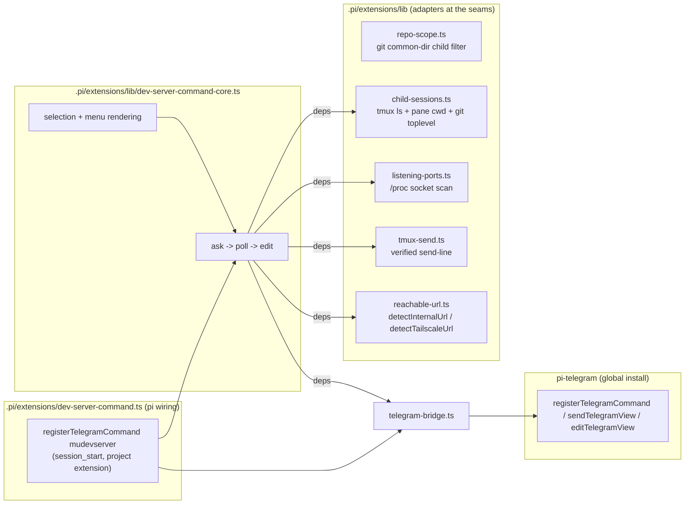

# Telegram `/mudevserver` for mu-commander child pi sessions — design

## Problem

The mu-commander orchestrator pattern runs each task as a child pi session in a
tmux session named `pi-<task>`, rooted at a leased treehouse worktree
(`scripts/sub-spawn.sh`). From the phone, the user wants to open a child's dev
server: list the live children of this repository, ask the selected one to start
its project's dev server, discover the port it binds, and deliver the intranet
and Tailscale links as clickable Telegram HTML links.

## Install scope: a project extension

The command ships **inside this repository** as a pi project extension:
`.pi/extensions/dev-server-command.ts` (with `lib/` and `telegram-bridge.ts`
beside it) [REQ-16]. Pi loads `<project>/.pi/extensions/` only for sessions of
that project, so the command exists in mu-commander sessions and nowhere else -
no runtime session gate is needed, and no global pi-config change is involved.
The project root used for scoping is derived from the extension's own location
(`import.meta.url` -> `<repo>/.pi/extensions` -> `<repo>`), so it is correct in
the main checkout and in every treehouse worktree.

## Child scope: same repository by git identity

The orchestrator can have children of *other* repositories running (its
`pi-main` session lives in mu-commander, but a child may be rooted in the
riak-t pool). Those must never be listed or addressed, so the tmux menu is
narrowed to checkouts of the same repository as the extension's project root
[REQ-17].

Repository identity is the git common directory:
`git rev-parse --path-format=absolute --git-common-dir` returns
`<main checkout>/.git` for the main checkout and every linked worktree of the
repository, and a different path for any other repository.
`repo-scope.ts` (under `.pi/extensions/lib/`) wraps that behind
`createRepoIdentity`/`listScopedChildren`, with a per-path common-dir cache
and a relative-path fallback for older git.

## Surfaces and constraints (verified against pi-telegram 0.51.6)

- **Command name.** `mudevserver` is a plain `[a-z0-9_]{1,32}` name, so a single
  `registerTelegramCommand({ name, showInMenu: true, emoji })` suffices.
- **Delivery.** The command context only exposes `reply(text)` (plain, no parse
  mode). The public `@llblab/pi-telegram/delivery` API (`sendTelegramView` /
  `editTelegramView`) renders `parseMode: "html"` views and returns an editable
  handle - required for the HTML anchors and the in-place refresh
  [REQ-10][REQ-13]. The command handler fires the flow asynchronously, so a
  slow child never holds the Telegram update loop [REQ-12].
- **No direct pi-telegram import.** A project extension cannot resolve
  `@llblab/pi-telegram`: pi resolves an extension's imports from the
  extension's own directory, this repository has no `node_modules`, and the
  package is installed only in the global agent directory (verified with pi's
  own jiti loader). `telegram-bridge.ts` isolates that seam behind a small
  `TelegramBridge` interface; the rest of the extension depends only on the
  interface and is fake-testable. See "pi-telegram access" below for the
  concrete strategy.
- **Links.** `lib/reachable-url.ts` is vendored from the pi-config repository
  unchanged: `detectInternalUrl(port)` / `detectTailscaleUrl(port)`, env
  overrides kept.

## pi-telegram access

`telegram-bridge.ts` resolves and dynamically imports the **public**
pi-telegram API from the global agent install (`PI_CODING_AGENT_DIR`, default
`~/.pi/agent`): `createRequire(<agentDir>/…).resolve("@llblab/pi-telegram/commands|delivery|outbound")`
honors the package exports map, and the resolved files are imported with
`import(pathToFileURL(...))`. That uses the same exported
`registerTelegramCommand` / `sendTelegramView` / `editTelegramView` /
`recordTelegramRuntimeEvent` the global extensions use, without adding a
dependency to this repository; the only environment coupling is the package
location, which is exactly where pi installs the global pi-telegram package.

The loader is lazy and cached, so the extension factory starts no work. A load
failure emits one diagnostic and leaves the extension inert: command
registration is a no-op and every view send reports "not delivered", which
aborts the flow before a child is touched. The bridge is injectable
(`createTelegramBridge({ load, warn })`), so both the forwarding and the inert
path are exercised with fakes.

## Child discovery

Children are the live tmux sessions matching `pi-<task>` (excluding `pi-main`
and the current session), because a tmux session dies with its last pane, so a
live session means a live child pi. The worktree is the session's
`#{pane_current_path}` (tmux starts each child with `-c "$WT"`); the repo is
the basename of the worktree's git toplevel. The same-repository filter then
drops every other repository's child [REQ-17]. No treehouse call is needed: the
pane path _is_ the leased worktree under the orchestrator's spawn convention.

## Dev-server detection and port capture

A dev server for phone access must bind a non-loopback address
(`0.0.0.0`/`::`/LAN/tailnet); a loopback-only listener is invisible to
`detectInternalUrl`, and counting one (e.g. a VS Code helper process rooted in
the worktree) as "already running" would suppress the ask.

`lib/listening-ports.ts` reads `/proc/net/tcp{,6}` for LISTEN sockets and scans
only the processes whose `cwd` is inside the candidate worktrees, matching
their fds against the listening socket inodes. This is deterministic, needs no
external tool (`ss` parsing avoided), and yields
`{port, address, pid, cwd, cmdline}`. A "dev server" is a non-loopback listener
rooted in the worktree; when several match, dev-server-looking command lines
win, then the lowest port.

## Ask semantics

`lib/tmux-send.ts` mirrors `scripts/_sub-common.sh:tmux_send_line`: type with
`send-keys -l` first, verify the text tail is visible in `capture-pane` (retype
twice if not), then send a **separate** `Enter` and retry while the flattened
pane stays frozen. A false result is reported to the chat and no polling starts
[REQ-6][REQ-7]. The instruction asks the child to start the repo's dev server
in the background bound to `0.0.0.0` and to keep working; the orchestrator
never guesses the child's dev command.

## Message lifecycle

One logical Telegram view per request: send "starting?…", then edit the same
handle when the listener appears (or on timeout / unconfirmed send), so the
chat gets one message, not a stream [REQ-13]. The wait polls every 2s up to
120s (`DEV_SERVER_WAIT_SECONDS` override); the command returns as soon as the
ask is issued and the poll runs in the background [REQ-12]. A per-task
in-flight set suppresses duplicate asks, and a generation counter lets
`session_shutdown` cancel polling flows without disabling the core for a later
session [REQ-14][REQ-15].

## Module map and seams



`createDevServerCore(deps)` owns selection, rendering, the ask/poll state
machine, and the in-flight set. Every dependency is injected (`listChildren`,
`discoverListeners`, `sendLine`, `detectReachableUrls`, `sendView`, `editView`,
`now`, `sleep`), so the whole flow is exercised with fakes and no tmux,
`/proc`, network, or Telegram.

- `telegram-bridge.ts` - the `TelegramBridge` interface and the concrete
  pi-telegram access; the only file that knows how to reach the bridge.
- `repo-scope.ts` - `createRepoIdentity` / `listScopedChildren`; the
  same-repository child filter.
- `child-sessions.ts` - `listChildSessions`: task-name parsing plus exec
  adapters for tmux and git.
- `listening-ports.ts` - pure `parseProcNetTcp`/`decodeProcAddress`/
  `isLoopbackAddress`/`devServerPorts`; live `scanListeningProcesses(roots)`.
- `tmux-send.ts` - pure `flattenPane`/`paneProbe`; `sendLine(run, …)`.
- `dev-server-command.ts` - the pi wiring and deferred registration; the
  bridge is injected (`registerDevServerSurfaces(pi, core, bridge)`), so tests
  drive the lifecycle with a fake bridge [REQ-15].

## Trade-offs

**Strengths.** No new services, ports, or tunnels; the extension is
self-contained in this repository and inert everywhere else; detection reuses
the proven reachable-URL probes; the port is discovered from the OS instead of
parsed from child prose, so a child that starts the server any way (tmux,
background, npm) is found as long as it binds non-loopback in its worktree;
repo identity via git common-dir follows worktrees automatically and never
matches by accident; the core is fully fake-testable.

**Weaknesses.** `/proc` and non-loopback listeners are Linux-specific (fine for
this personal setup) and a server the child starts loopback-only will time out
with a diagnostic instead of links; the host-name/Vite `allowedHosts` mismatch
case shows the explicit "no reachable URL" note [REQ-11]; the 120s wait is a
guess for slow children (env-tunable), and a timeout is recoverable by
re-running the command once the child catches up.

**Superseded in pi-config.** The global `/dev-server`-era work in the pi-config
repository is removed: only the deletion of the superseded
`extensions/dev-server-tunnel.ts` remains there. Nothing in
`extensions/lavish-telegram/**` or the public behavior of
`extensions/lib/reachable-url.ts` changes.

## Audit notes (independent pass)

The deep-module seam held again after the relocation: the flow is exercised
entirely through `createDevServerCore`'s injected dependencies, the
pi-telegram access sits behind one injectable bridge, and each adapter is
testable at its own seam. The pass found one thin test: [REQ-16] claims the
command is not installed globally, but the test only asserted the project
path; it now also asserts the file is absent from the resolved global agent
extensions directory.

Less valuable observations, deliberately left as-is:

- `RunExec` is declared structurally in both `child-sessions.ts` and
  `tmux-send.ts`; a shared 6-line type module is not earned yet.
- `menuView` probes reachable URLs for every already-running child on every
  menu render. Probes run in parallel and only for listening children, so the
  cost is bounded; caching would go stale exactly when the user re-runs the
  command to see fresh state.
- `scanListeningProcesses` reads `/proc` sequentially: one `cwd` readlink per
  live pid (bounded) plus fd scans only for pids under the worktrees.
- The Telegram bot command list is synced from the registry, so a menu entry
  published while the project extension is loaded may linger in the client
  until the next sync; routing in a session without the project extension does
  not know the command.

## Verification

Tests (Node 22.18+ strips the types; no test runner is configured in this
repository):

```bash
node --test specs/dev-server-command/*.test.ts
```

Typecheck (this repository has no `node_modules`; point tsc at Node's types):

```bash
tsc --noEmit --skipLibCheck --module esnext --moduleResolution bundler \
  --target es2022 --allowImportingTsExtensions \
  --typeRoots "$HOME/.nvm/versions/node/v24.21.0/lib/node_modules/@earendil-works/pi-coding-agent/node_modules/@types" \
  --types node .pi/extensions/*.ts .pi/extensions/lib/*.ts specs/dev-server-command/*.test.ts
```
