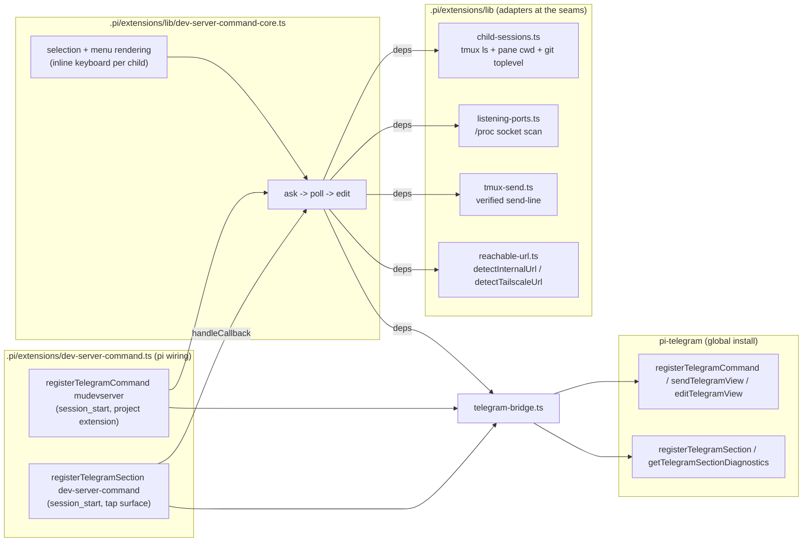

# Telegram `/mudevserver` for mu-commander child pi sessions — design

## Problem

The mu-commander orchestrator pattern runs each task as a child pi session in a
tmux session named `pi-<task>`, rooted at a leased treehouse worktree
(`scripts/sub-spawn.sh`). From the phone, the user wants to open a child's dev
server: list the live children of *any* repository's pool, ask the selected one
to start its project's dev server, discover the port it binds, and deliver the
intranet and Tailscale links as clickable Telegram HTML links.

## Install scope: a project extension

The command ships **inside this repository** as a pi project extension:
`.pi/extensions/dev-server-command.ts` (with `lib/` and `telegram-bridge.ts`
beside it) [REQ-16]. Pi loads `<project>/.pi/extensions/` only for sessions of
that project, so the command exists in mu-commander sessions and nowhere else -
no runtime session gate is needed, and no global pi-config change is involved.
The project root used for scoping is derived from the extension's own location
(`import.meta.url` -> `<repo>/.pi/extensions` -> `<repo>`), so it is correct in
the main checkout and in every treehouse worktree.

## Child scope: every pool on the machine

The command runs as a project extension (session gate: none), but its *menu*
is deliberately **cross-repo**: it lists every live `pi-<task>` child session
on the machine, whichever treehouse pool (`~/.treehouse/<repo>-*/`) its
worktree belongs to, and each entry carries the child's repo name so
`riak-166-driver-info-view` (riak-t) is distinguishable from a mu-commander
child [REQ-17]. Selecting a child of another repository works end to end -
verified ask into its `pi-<task>` pane, port capture, intranet + Tailscale
links - because the flow is rooted at the selected child's worktree path and
the port scan reads `/proc/net/tcp{,6}` host-wide [REQ-18].

Discovery is unchanged: the live tmux sessions matching `pi-<task>` (see
*Child discovery*). No repository filter, no treehouse lease call, and no
repo-scope module: the git-common-dir scoping that shipped with PR #22 is
removed with this change (`lib/repo-scope.ts` deleted).

## Surfaces and constraints (verified against pi-telegram 0.51.6)

- **Command name.** `mudevserver` is a plain `[a-z0-9_]{1,32}` name, so a single
  `registerTelegramCommand({ name, showInMenu: true, emoji })` suffices.
- **Delivery.** The command context only exposes `reply(text)` (plain, no parse
  mode). The public `@llblab/pi-telegram/delivery` API (`sendTelegramView` /
  `editTelegramView`) renders `parseMode: "html"` views and returns an editable
  handle - required for the HTML anchors and the in-place refresh
  [REQ-10][REQ-13]. The command handler fires the flow asynchronously, so a
  slow child never holds the Telegram update loop [REQ-12].
- **Inline keyboard.** `TelegramDeliveryView.replyMarkup` carries the menu's
  `section:<token>:select:<task>` buttons (one per child
  [REQ-19]); taps are answered and dispatched by a registered pi-telegram
  *section* - see *Tap-to-select* below. The `./keyboard` subpath exports types
  only, so the inline-keyboard shape is declared structurally.
- **No direct pi-telegram import.** A project extension cannot resolve
  `@llblab/pi-telegram`: pi resolves an extension's imports from the
  extension's own directory, this repository has no `node_modules`, and the
  package is installed only in the global agent directory (verified with pi's
  own jiti loader). `telegram-bridge.ts` isolates that seam behind a small
  `TelegramBridge` interface; the rest of the extension depends only on the
  interface and is fake-testable. See "pi-telegram access" below for the
  concrete strategy.
- **Links.** `lib/reachable-url.ts` is vendored from the pi-config repository
  unchanged: `detectInternalUrl(port)` / `detectTailscaleUrl(port)`, env
  overrides kept.

## pi-telegram access

`telegram-bridge.ts` resolves and dynamically imports the **public**
pi-telegram API from the global agent install (`PI_CODING_AGENT_DIR`, default
`~/.pi/agent`): `createRequire(<agentDir>/…).resolve("@llblab/pi-telegram/commands|delivery|outbound")`
honors the package exports map, and the resolved files are imported with
`import(pathToFileURL(...))`. That uses the same exported
`registerTelegramCommand` / `sendTelegramView` / `editTelegramView` /
`recordTelegramRuntimeEvent` the global extensions use, without adding a
dependency to this repository; the only environment coupling is the package
location, which is exactly where pi installs the global pi-telegram package.

The loader is lazy and cached, so the extension factory starts no work. A load
failure emits one diagnostic and leaves the extension inert: command
registration is a no-op and every view send reports "not delivered", which
aborts the flow before a child is touched. The bridge is injectable
(`createTelegramBridge({ load, warn })`), so both the forwarding and the inert
path are exercised with fakes.

## Tap-to-select: how a button tap reaches the extension

The requirement is a Telegram inline-keyboard menu: one button per child,
tapped instead of typed. Research against pi-telegram 0.51.6 dist sources
(`outbound-buttons.js`, `routing.js`, `menu.js`, `sections.js`, `updates.js`
plus `docs/updates.md`, `docs/callback-namespaces.md`, `docs/sections.md`)
found exactly four ways a `callback_query` can reach extension code, and only
one answers the tap without a model turn:

1. **Assistant button store (`tgbtn:`).** `planTelegramButtonReply` registers
   buttons only while planning *assistant* markdown replies; a tap resolves
   the store and enqueues a prompt turn. Extension-sent views never enter the
   planner, and every tap would start an assistant turn anyway.
2. **`[callback] <data>` fallback.** pi-telegram answers any unknown,
   non-owned `callback_data` promptly but forwards it to the *assistant* as a
   prompt turn - one model turn (latency plus cost) per tap instead of the
   in-process flow.
3. **`registerTelegramUpdateHandler` (`@llblab/pi-telegram/updates`).** Runs
   before routing and can `consume` the update, but the public surface ships
   no `answerCallbackQuery`: the package deliberately keeps raw transport
   private, so consuming leaves the button spinning and passing reproduces
   route 2.
4. **Extension sections (`@llblab/pi-telegram/sections`).** pi-telegram's
   *managed* callback surface: `handleCallback(ctx)` receives `answerCallback`
   (answer promptly, then return `"handled"`), stale tokens are answered by
   the bridge itself ("This section is no longer available."), and callbacks
   route from **any** message carrying `section:<token>:<action>:<payload>` -
   only the `open` and `settings` actions require stored menu state, so a
   `select` action on our own `sendTelegramView` message dispatches straight
   to the section. `section:` is an owned prefix, so no `[callback]` text
   leaks to the assistant.

**Chosen route: sections.** The extension registers one section
(`dev-server-command`, label `🖥 Dev server`) beside the command on
`session_start` [REQ-23]. Its `render()` returns the same child menu, so the
main-menu row is a working entry point instead of a dead registration; its
`handleCallback` answers the tap first [REQ-21], then dispatches the *exact
same* `core.handle(target, task)` flow the typed selection uses - verified ask,
port capture, links refresh, in-flight guard, all unchanged [REQ-20]. Unknown
actions return `"pass"`, which pi-telegram answers itself.

Button callback data is `section:<token>:select:<task>`. `ctx.callbackData`
exists only inside a section context (the command path has none), so the
bridge builds the string from the registry token published by
`getTelegramSectionDiagnostics()` - the same construction pi-telegram's own
builder performs - and returns `null` when the package is absent or the data
would exceed Telegram's 64-byte cap (the value behind the package's
`TELEGRAM_CALLBACK_DATA_MAX_BYTES`). A child whose callback does not fit is
listed without a button while typed selection still resolves it [REQ-25]; an
absent or failed tap surface never breaks the command [REQ-24][REQ-26].

Rejected alternatives, for the record: raw update handlers cannot answer the
public API; the `tgbtn:` store is assistant-authored only; the
`[callback]` fallback would turn every tap into a model turn on the
orchestrator session.

## Child discovery

Children are the live tmux sessions matching `pi-<task>` (excluding `pi-main`
and the current session), because a tmux session dies with its last pane, so a
live session means a live child pi. The worktree is the session's
`#{pane_current_path}` (tmux starts each child with `-c "$WT"`); the repo is
the basename of the worktree's git toplevel - pool-agnostic, so a riak-t
worktree under `~/.treehouse/riak-t-*/` resolves to repo `riak-t`. There is no
repository filter [REQ-17]: every pool on the machine is listed. No treehouse
call is needed: the pane path _is_ the leased worktree under the orchestrator's
spawn convention.

## Dev-server detection and port capture

A dev server for phone access must bind a non-loopback address
(`0.0.0.0`/`::`/LAN/tailnet); a loopback-only listener is invisible to
`detectInternalUrl`, and counting one (e.g. a VS Code helper process rooted in
the worktree) as "already running" would suppress the ask.

`lib/listening-ports.ts` reads `/proc/net/tcp{,6}` for LISTEN sockets and scans
only the processes whose `cwd` is inside the candidate worktrees, matching
their fds against the listening socket inodes. This is deterministic, needs no
external tool (`ss` parsing avoided), and yields
`{port, address, pid, cwd, cmdline}`. A "dev server" is a non-loopback listener
rooted in the worktree; when several match, dev-server-looking command lines
win, then the lowest port.

## Ask semantics

`lib/tmux-send.ts` mirrors `scripts/_sub-common.sh:tmux_send_line`: type with
`send-keys -l` first, verify the text tail is visible in `capture-pane` (retype
twice if not), then send a **separate** `Enter` and retry while the flattened
pane stays frozen. A false result is reported to the chat and no polling starts
[REQ-6][REQ-7]. The instruction asks the child to start the repo's dev server
in the background bound to `0.0.0.0` and to keep working; the orchestrator
never guesses the child's dev command.

## Message lifecycle

One logical Telegram view per request: send "starting?…", then edit the same
handle when the listener appears (or on timeout / unconfirmed send), so the
chat gets one message, not a stream [REQ-13]. The wait polls every 2s up to
120s (`DEV_SERVER_WAIT_SECONDS` override); the command returns as soon as the
ask is issued and the poll runs in the background [REQ-12]. A per-task
in-flight set suppresses duplicate asks, and a generation counter lets
`session_shutdown` cancel polling flows without disabling the core for a later
session [REQ-14][REQ-15].

**Menu versus flow.** The menu message with its keyboard is a separate logical
message from the flow [REQ-19]: tapping a button does *not* edit the menu in
place; the flow sends its own "starting…" view and refreshes *that* handle
(REQ-11…REQ-13 unchanged) [REQ-20]. The menu keeps its list and buttons, so a
second tap selects another child, a stale tap reports its error without
destroying the list [REQ-22], and no cross-message handle tracking is needed -
the menu's delivery handle is discarded right after send. A tap for a child
that is already being asked hits the existing in-flight guard [REQ-14].

## Module map and seams



`createDevServerCore(deps)` owns selection, rendering, the ask/poll state
machine, and the in-flight set. Every dependency is injected (`listChildren`,
`discoverListeners`, `sendLine`, `detectReachableUrls`, `sendView`, `editView`,
`now`, `sleep`), so the whole flow is exercised with fakes and no tmux,
`/proc`, network, or Telegram.

- `telegram-bridge.ts` - the `TelegramBridge` interface and the concrete
  pi-telegram access (command, section, views, callback data); the only file
  that knows how to reach the bridge.
- `child-sessions.ts` - `listChildSessions`: task-name parsing plus exec
  adapters for tmux and git; cross-repo, no scope filter [REQ-17].
- `listening-ports.ts` - pure `parseProcNetTcp`/`decodeProcAddress`/
  `isLoopbackAddress`/`devServerPorts`; live `scanListeningProcesses(roots)`.
- `tmux-send.ts` - pure `flattenPane`/`paneProbe`; `sendLine(run, …)`.
- `dev-server-command.ts` - the pi wiring and deferred registration of both
  surfaces (command plus section tap handler); the bridge is injected
  (`registerDevServerSurfaces(pi, core, bridge)`), so tests drive the lifecycle
  with a fake bridge [REQ-15][REQ-23].

## Trade-offs

**Strengths.** No new services, ports, or tunnels; the extension is
self-contained in this repository and inert everywhere else; detection reuses
the proven reachable-URL probes; the port is discovered from the OS instead of
parsed from child prose, so a child that starts the server any way (tmux,
background, npm) is found as long as it binds non-loopback in its worktree;
the menu spans every pool with repo labels so scope stays visible rather than
enforced; the core is fully fake-testable.

**Weaknesses.** `/proc` and non-loopback listeners are Linux-specific (fine for
this personal setup) and a server the child starts loopback-only will time out
with a diagnostic instead of links; the host-name/Vite `allowedHosts` mismatch
case shows the explicit "no reachable URL" note [REQ-11]; the 120s wait is a
guess for slow children (env-tunable), and a timeout is recoverable by
re-running the command once the child catches up.

**Superseded in pi-config.** The global `/dev-server`-era work in the pi-config
repository is removed: only the deletion of the superseded
`extensions/dev-server-tunnel.ts` remains there. Nothing in
`extensions/lavish-telegram/**` or the public behavior of
`extensions/lib/reachable-url.ts` changes.

## Audit notes (independent pass)

The deep-module seam held again after the relocation: the flow is exercised
entirely through `createDevServerCore`'s injected dependencies, the
pi-telegram access sits behind one injectable bridge, and each adapter is
testable at its own seam. The pass found one thin test: [REQ-16] claims the
command is not installed globally, but the test only asserted the project
path; it now also asserts the file is absent from the resolved global agent
extensions directory.

Less valuable observations, deliberately left as-is:

- `RunExec` is declared structurally in both `child-sessions.ts` and
  `tmux-send.ts`; a shared 6-line type module is not earned yet.
- `menuView` probes reachable URLs for every already-running child on every
  menu render. Probes run in parallel and only for listening children, so the
  cost is bounded; caching would go stale exactly when the user re-runs the
  command to see fresh state.
- `scanListeningProcesses` reads `/proc` sequentially: one `cwd` readlink per
  live pid (bounded) plus fd scans only for pids under the worktrees.
- The Telegram bot command list is synced from the registry, so a menu entry
  published while the project extension is loaded may linger in the client
  until the next sync; routing in a session without the project extension does
  not know the command.

## Audit notes (cross-repo pass, independent)

Read from disk (feature + modified sources, not the design or tests) against
the `codebase-design` vocabulary. Verdict: the change *reduces* architecture
and the seams hold; no structural problem worth a refactor was found.

- **Deletion test passed by deletion.** `lib/repo-scope.ts` carried real
  complexity (git common-dir identity, per-path cache, legacy-git fallback, a
  filter) for one requirement; with REQ-17 inverted the whole chain
  (`projectRoot` / `RepoIdentity` / `listScopedChildren`) vanished rather than
  decaying into a pass-through shell - no caller re-implements scoping, and
  grep shows no dead references.
- **Locality improved.** The cross-repo policy now lives in exactly one code
  line (the wiring's `listChildren` in `createWiredCore`) plus its comment;
  previously the scope decision was split across enumeration and filtering.
- **`createWiredCore` stayed deep**: one options object (`{bridge, run?}`)
  behind which discovery, `/proc` scan, URL probes and delivery are wired; the
  new `run` option is the test seam at the same place the other adapters sit.

Less valuable observations, deliberately left as-is:

- `WiredCoreOptions.run` is optional, so the production default `runExec` is
  implicit interface knowledge for tests; making it required would be more
  explicit but touches both call sites for no behaviour gain.
- `cross-repo.test.ts` grows a fake-tmux adapter shaped like `createTmuxRun`
  in `dev-server-command.test.ts`; a shared fake would deduplicate, but the
  two deliberately differ (send-recording vs. menu-serving) and node test
  files are standalone - not earned yet.
- `repoName` runs one `git rev-parse` per child per render and `menuView`
  probes reachable URLs for every listening child (pre-existing note above);
  both are bounded by the handful of live children, and caching would go stale
  exactly when the user re-runs the command for fresh state.

## Audit notes (tap-button pass, independent)

Read from disk (feature file plus the modified sources; not this doc, not the
tests) against the `codebase-design` vocabulary. Verdict: the change rides the
existing seams - no new module, one optional core dependency, one interface
method, two bridge methods - and the rejected callback routes are recorded
above rather than justified after the fact.

- **The seams held.** The tap surface arrives as `buttonCallbackData` (menu)
  plus `registerSection`/`sectionCallbackData` (bridge); the flow itself
  (selection -> ask -> poll -> edit) is untouched, so a tap reuses the exact
  typed-selection path instead of forking it - [REQ-20] and [REQ-22] pass
  through the same `resolveSelection` and `runFlow` a typed name does.
- **Refactored during the pass:** the bridge's section diagnostic type was
  narrowed to the `{id, token}` fields actually read.
- `renderMenu` deliberately repeats `handle`'s list-plus-catch for the menu
  branch: sharing it would make `handle` list children twice (an extra tmux
  call per command).

Less valuable observations, deliberately left as-is:

- The menu builds rows and buttons in two sequential `Promise.all` passes;
  merging them would interleave reachable-URL probes with callback building
  for no observable gain.
- `order: 100` on the section registration is a magic constant with no other
  project sections to order against.
- The section doubles as a main-menu row (a section requires a label); its
  `render` returns the same menu, so the row is a working entry point rather
  than dead surface - but it is one more Telegram surface than the command
  alone would have shown.
- When `answerCallback` itself rejects, pi-telegram answers "Section error…"
  and the dispatch is skipped; the tap is retryable and the failure lands in
  pi-telegram's section diagnostics, so no local recovery was added.

## Verification

Tests (Node 22.18+ strips the types; no test runner is configured in this
repository):

```bash
node --test specs/dev-server-command/*.test.ts
```

Typecheck (this repository has no `node_modules`; point tsc at Node's types):

```bash
tsc --noEmit --skipLibCheck --module esnext --moduleResolution bundler \
  --target es2022 --allowImportingTsExtensions \
  --typeRoots "$HOME/.nvm/versions/node/v24.21.0/lib/node_modules/@earendil-works/pi-coding-agent/node_modules/@types" \
  --types node .pi/extensions/*.ts .pi/extensions/lib/*.ts specs/dev-server-command/*.test.ts
```
