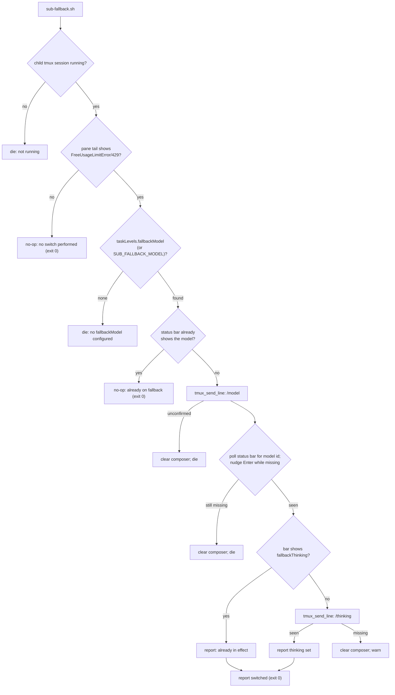

# Design: fallback model for the free provider's usage limit (sub-fallback)

## Summary

The free provider used by the `easy`/`standard` child levels can run out of
quota and answer every request with `FreeUsageLimitError` (HTTP 429). Pi
classifies that provider error as **terminal** — it retries transient 429s but
deliberately not `FreeUsageLimitError`/`GoUsageLimitError`
(`isTerminalRateLimitError` in pi's provider code) — so the child stops and the
task stalls until a human intervenes.

This change makes the recovery configurable and mechanical:

1. `config.json` gains `taskLevels.fallbackModel` (the model to switch a
   stuck child to) and `taskLevels.fallbackThinking` (the thinking level to
   leave the child on). Sibling of `levels`, same generic-namespace contract:
   unknown keys stay ignored.
2. `scripts/sub-fallback.sh <task>` detects the provider error in the child's
   pane, drives `/model <fallbackModel>` into the running child through the
   shared verified send (`tmux_send_line`), confirms the switch against the pi
   status bar, and leaves the child on `/thinking <fallbackThinking>` when the
   model switch did not already clamp there.
3. It is a **no-op** when the pane shows no free-limit error, when the child
   is already on the fallback model, and when no fallback is configured (the
   latter fails only if an actual error is present and cannot be recovered).

Shipped values: `fallbackModel = "opencode-go/deepseek-v4.1-flash"`,
`fallbackThinking = "max"`.

## Stated / deduced / assumed

- **Stated**: config entry in the generic namespace; use the fallback
  automatically when a child hits `FreeUsageLimitError`; must go through the
  verified send; must confirm the switch in the status bar; no-op with a clear
  message without an error; never switch speculatively; graceful degradation
  when the config entry is absent: specs + TDD + shellcheck; AGENTS.md update.
- **Deduced** (verified against the installed pi 0.87.1 in scratch tmux panes,
  including a full end-to-end recovery of a really erroring child):
  - `/model <provider/model>` switches a running TUI directly (no picker) and
    echoes `Model: <id>`; the footer (last non-empty line) becomes
    `(<provider>) <model-id> • <thinking>`.
  - `/thinking <level>` validates strictly: `deepseek-v4.1-flash` supports
    `low`, `high`, `max`; `xhigh` is rejected with
    `Error: Unknown thinking level "xhigh"`. `--thinking xhigh` on launch is
    *clamped* to `max` instead, and switching to the model clamps the session's
    current level the same way, so an `xhigh` `standard` child lands on `max`
    with no `/thinking` needed. `fallbackThinking: "max"` therefore keeps the
    `hard` level's effective effort; an operator can lower it to `high` in
    config to contain cost.
  - Pi's slash-command argument completion can consume the Enter that
    `tmux_send_line` sends: the pane *reacts* (the popup closes) while the
    command stays in the composer, so the shared helper alone cannot prove
    submission. Observed twice in the live e2e run; the helper therefore
    treats the **status bar** as the ground truth and nudges the verified line
    with bare Enters until it lands.
  - `ctrl+u` is pi's `tui.editor.deleteToLineStart` (keybindings doc), so a
    command that cannot be confirmed can be cleared instead of being left
    parked for an unrelated Enter to submit.
- **Assumed**: operators run the helper from the orchestrator after a child
  reports BLOCKED or after monitoring shows the error; detection is textual
  (see weaknesses) and the helper is explicitly invoked — it is not a daemon.
- **Open**: none blocking.

## Decisions

1. **Config shape** — `taskLevels.fallbackModel` and
   `taskLevels.fallbackThinking`, exactly the shape suggested by the task
   brief, under the existing namespace. `SUB_FALLBACK_MODEL` /
   `SUB_FALLBACK_THINKING` override the config, mirroring
   `SUB_MODEL`/`SUB_THINKING`; `SUB_LEVELS_CONFIG` still relocates the file.
2. **Separate helper, not wired into `sub-status.sh`** — status is read-only
   monitoring; side effects belong to an explicitly invoked script. A separate
   `sub-fallback.sh` keeps each script single-concern (the family's
   convention), lets the recovery be idempotent (`no error`/`already on
   fallback` are no-ops), and means no existing helper reads the fallback
   config at all — degradation is structural.
3. **Detect first, switch second** — the helper refuses to send anything
   unless `pane_has_free_limit_error` matches the free-limit signature in the
   last `FALLBACK_SCAN_LINES` (default 50) lines of the child's pane.
4. **Status bar is the confirmation, the composer is cleaned up** — after
   `tmux_send_line`, the helper polls the footer for the model id and keeps
   nudging Enter while it is missing (`FALLBACK_SEND_ATTEMPTS`); only the
   footer decides success. If a switch still cannot be confirmed, the helper
   clears the composer (`C-u`) and dies — never leaving `/model …` parked for
   a later Enter to submit, and never reporting a switch that did not land.
5. **Thinking is applied only when the model switch did not clamp to it** —
   after the model is confirmed, the footer is checked for
   `fallbackThinking`; if it is already in effect, no command is sent.
   Otherwise `/thinking <level>` is sent and confirmed the same way. The
   thinking step is a refinement, not the recovery: an unconfirmed thinking
   send warns (after clearing the composer) instead of failing a recovered
   child.
6. **Model switch via the verified send** — `tmux_send_line` re-types and
   retries Enter; sending `/model` with a raw `send-keys` races the TUI (both
   probes in this task dropped the first Enter), which is exactly the failure
   the shared helper exists to prevent.

## Entities

- **`config.json`** (modified) — `taskLevels` gains `fallbackModel` and
  `fallbackThinking`; `levels`/`default` unchanged.
- **`scripts/_sub-common.sh`** (modified, new helpers):
  - `resolve_fallback_model` / `resolve_fallback_thinking` — echo the env
    override or the `.taskLevels` value; empty + exit 0 on absent/unreadable/
    malformed config (no warnings — absence is a valid configuration);
  - `pane_last_line <task>` — last non-empty line of the task's pane (pi's
    status bar), empty when the session is not running;
  - `pane_has_free_limit_error <task> [lines]` — pane-tail match against
    `FreeUsageLimitError` or a 429 with rate-limit wording;
  - `pane_shows_model <task> <model>` — status-bar match on the model id
    (pi renders the part after the final `/`);
  - `pane_shows_thinking <task> <level>` — status-bar match on the level after
    pi's `•` bullet (`off` renders as `• thinking off`).
- **`scripts/sub-fallback.sh`** (new) — the recovery flow above, with
  `confirm_model`/`confirm_thinking` (poll + Enter nudge) and
  `clear_composer`; exits 0 on no-op/success, dies loudly when an error is
  present but unrecoverable.
- **`specs/free-limit-fallback/`** (new) — this design + the feature file.
- **`tests/free-limit-fallback.test.sh`** (new) — one test per
  `[REQ-1]`…`[REQ-13]` plus a supplementary popup-swallow regression,
  fake-tmux sandbox (no real session touched).
- **`AGENTS.md`** — "Child model and thinking levels" section documents the
  fallback entry, the helper, and the operator command.

## Behaviour and data flow

## Proposed changes (files/modules)

| File | Change |
|---|---|
| `config.json` | add `taskLevels.fallbackModel` + `taskLevels.fallbackThinking` |
| `scripts/_sub-common.sh` | fallback resolvers + pane helpers (last line, error detection, model/thinking probes) |
| `scripts/sub-fallback.sh` | new helper: detect → verified switch → status-bar confirm (no-op otherwise) |
| `specs/free-limit-fallback/*` | feature file + this design |
| `tests/free-limit-fallback.test.sh` | behavioural suite, one test per scenario + popup regression |
| `AGENTS.md` | document the fallback entry and the recovery command |
| `tests/task-levels.test.sh` | make executable (pre-existing 0644; the rest of `tests/*.sh` is 0755) |

## Task list

- [x] Deduce atomic requirements from the brief → [REQ-1]…[REQ-13]
- [x] Verify pi behaviour empirically (footer format, `/model` direct switch,
      `/thinking` validation/clamping, Enter races, completion popup) in
      scratch tmux panes
- [x] Write the feature file and this design doc
- [x] RED: run the new suite against the unchanged tree
- [x] GREEN: implement config + helpers + helper script; suite passes
- [x] Real end-to-end recovery: a live child stuck on the 429 switched to
      deepseek-v4.1-flash @ max, re-running the helper is a no-op
- [x] Popup-swallow hardening (status-bar confirmation + Enter nudge + C-u
      cleanup) with a fake-tmux regression
- [x] Full suite (`tests/*.sh`) green, shellcheck clean
- [x] AGENTS.md section updated
- [x] Code audit pass (below)

## Strengths / Weaknesses

- **Strengths**: recovery is configuration, not code; the helper is a deep
  module (one positional arg hides detection, idempotence, verified delivery,
  status-bar confirmation, and composer cleanup); existing helpers are
  untouched, so a missing/broken fallback entry cannot affect spawning; the
  switch reuses the same verified send seam as every other child instruction;
  every failure path is explicit about what was and was not changed.
- **Weaknesses**:
  1. Detection is textual: a pane that *quotes* the exact error signature
     (e.g. while reading the brief of this very task) could false-positive.
     Mitigated by the tail window and by the helper being operator-invoked on
     a child that is actually stuck; a false positive is reversible with
     another `/model`.
  2. The status-bar probes are fixed-string matches on pi's rendered footer
     (model id after the final `/`, level after `•`). A relabelled or
     truncated footer (very long model id) would make confirmation fail even
     though the switch took effect — the loud failure, not a wrong success.
  3. `fallbackThinking` is model-specific (`max` for deepseek-v4.1-flash);
     changing `fallbackModel` without adjusting it makes the thinking step
     warn (not fail) after clearing the composer.
  4. The Enter nudge and the `C-u` cleanup assume pi's default editor
     keybindings (`enter` submits, `ctrl+u` deletes to line start); a
     rebinding in the child's keybindings.json would weaken the nudge (the
     status-bar confirmation still fails loudly).
  5. The helper only recovers a *running* child; a child that already exited
     on the error needs a normal respawn/recovery, out of scope here.

## Code audit (post-implementation, independent pass)

Audited per the `codebase-design` deep-module vocabulary: the feature file and
the changed source files were read from disk, ignoring the conversational
rationale above.

- **Overview**: `sub-fallback.sh` is the external seam — one positional
  argument, and four observable outcomes (no-op / already-on-fallback /
  switched / loud failure), with detection, verified delivery, status-bar
  confirmation, and composer cleanup hidden behind `_sub-common.sh` helpers.
  Those helpers are the internal seams the tests cross directly
  ([REQ-1]…[REQ-4], [REQ-7]): resolvers are pure config reads
  (env-overridable), the pane probes take only `(task, …)` and touch nothing
  but tmux. `confirm_model`/`confirm_thinking` are deliberately local to
  `sub-fallback.sh`: no other caller needs them, and the fake-tmux test
  exercises them through the script's interface. The spec's [REQ-n] chain
  stayed 1:1 with the test cases through implementation (12→13 after the
  thinking behavior was split into its own atomic requirement), with the
  popup-swallow regression carried as a supplementary test.
- **Files**: `scripts/_sub-common.sh` (`resolve_fallback_*`,
  `pane_last_line`, `pane_has_free_limit_error`, `pane_shows_model`,
  `pane_shows_thinking`), `scripts/sub-fallback.sh`, `config.json`.
- **Problem / Solution / Benefits**: no major improvement detected. The
  deletion test holds: removing `sub-fallback.sh` would push the
  detect→send→confirm→cleanup sequence into the orchestrator's manual tmux
  commands, which is exactly the fragile interaction this helper replaces.
- **Less valuable improvements** (noted, deliberately not done):
  1. The 429 alternative in `_FALLBACK_ERROR_RE` overlaps the primary
     `FreeUsageLimitError` signature — a generalisation for sibling free/Go
     limit failures, not dead code; its value is speculative until a
     non-`FreeUsageLimitError` case shows up.
  2. `confirm_model`/`confirm_thinking` are near-duplicates differing only in
     the probe function; a parameterised `confirm <probe> <value>` would
     remove the pair, at the cost of an eval/indirect call in shell. *Worth
     exploring* if a third confirmed switch appears; today the duplication is
     two small, readable loops.
  3. The probe timeout/delay are env-tunable (`FALLBACK_PROBE_*`,
     `FALLBACK_SEND_ATTEMPTS`) but undocumented in AGENTS.md; they are test
     hooks first, tuning knobs second.
- **Recommendation strength**: Speculative for all three; audit verdict — no
  architectural friction detected, ship it.
