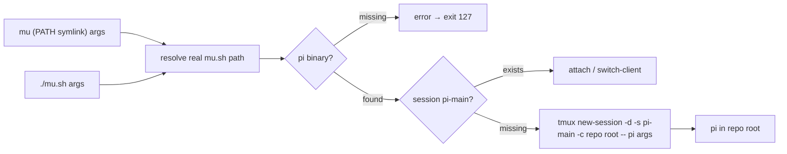

# mu design

`mu.sh` (invoked as `mu` via a PATH symlink) is the successor of `pi.sh`, the
root-level interactive launcher for pi. The key inversion: `pi.sh` *refused*
the reserved names `pi-main` / `pi-*` so it could never collide with the
orchestrator; `mu` deliberately targets `pi-main`, because its whole purpose
is to put the user into that exact durable session. It is a thin process
boundary around tmux and must stay usable standalone — it does not source
`scripts/_sub-common.sh`, does not arrange layouts, and does not
verified-send prompts.



## Behaviour

- The script first resolves its own real path by following symlinks (a
  `readlink` loop over `${BASH_SOURCE[0]}`), so `mu` invoked through
  `~/.local/bin/mu` roots the session at the repository directory containing
  the real `mu.sh`, never at the symlink's directory. A direct `./mu.sh`
  invocation is unaffected — same root as before ([REQ-8]).
- `PI_BIN` wins when set (resolved through `command -v`, so a bare name works
  too); otherwise the first `pi` on `PATH`. Nothing found → a clear message on
  stderr prefixed `mu:` (the command the user actually types) and exit 127
  **before** tmux is called ([REQ-6], [REQ-7]).
- Missing session → `tmux new-session -d -s pi-main -c <repo root> -- pi
  <args>`; the session is rooted at the directory containing the real `mu.sh`
  (the repository root), and extra arguments reach pi with their boundaries
  preserved ([REQ-1], [REQ-2]).
- Existing session → never a second pi, just a hand-off ([REQ-3]).
- Hand-off: `exec tmux switch-client` when `$TMUX` is set (a nested
  `attach-session` would be refused), `exec tmux attach-session` otherwise
  ([REQ-4], [REQ-5]). Exact `=pi-main` targets avoid tmux prefix matching.

## PATH installation

`~/.local/bin` (already on PATH) holds a symlink `mu` → the **main
checkout's** `mu.sh`:

```bash
ln -s /home/jseto/programming-projects/ai-commander/mu.sh ~/.local/bin/mu
```

Pointing at the main checkout (not a pooled worktree) is deliberate: `mu` is
a personal convenience launcher, and thanks to [REQ-8] the `pi-main` session
it creates is always rooted at the main checkout — never at an ephemeral
treehouse worktree.

## Relation to scripts/start-main.sh (coexists, untouched)

`start-main.sh` is the orchestrator's authoritative launcher: it roots the
session at the *main checkout* even from a linked worktree, applies the
`main-vertical` / `main-pane-width 50%` layout, and boots pi through the
verified `tmux_send_line`. `mu` is the human-facing shortcut: create the
session if absent, run pi in it directly, attach/switch. Whichever runs first
creates `pi-main`; the other attaches to it without restarting anything
([REQ-3]), so the two can never fight. Unlike `start-main.sh`, `mu` roots the
session at its own (resolved) checkout — it is not part of the orchestration
machinery and deliberately avoids git/main-checkout resolution to stay a
one-file launcher.

## Files

| Change | File |
|---|---|
| renamed + updated | `com.sh` → `mu.sh` (executable, bash, `set -euo pipefail`, shellcheck-clean) |
| removed | `pi.sh` (superseded) |
| renamed + updated | `specs/com-sh-launcher/` → `specs/mu-launcher/` (REQ ids intact; +[REQ-8]) |
| renamed + updated | `tests/test-com-sh.sh` → `tests/test-mu.sh` (+[REQ-8] block) |
| new (not repo content) | `~/.local/bin/mu` → `<main checkout>/mu.sh` PATH symlink |

## Audit notes (code-auditor, post-implementation)

Audited `mu.sh` against `specs/mu-launcher/mu-launcher.feature` (source of
truth read from disk; design doc excluded from the audit). No major
improvements detected — the launcher stays a one-file leaf module whose
interface (`mu [args…] → pi-main rooted at the repo`) did not grow: the new
symlink resolution is implementation hidden behind the same seam, which is
depth-positive, and its `while -h` loop only reaches `readlink` when the
script is actually symlinked, keeping the fully-controlled `PATH` half of
[REQ-7] a two-utility path. Less valuable improvements, recorded and
deliberately not applied:

- `readlink -f` would replace the 7-line loop with one call — rejected:
  GNU-specific *and* it would break [REQ-7]'s controlled-`PATH` test (no
  `readlink` there, direct invocation never needs it); the loop keeps
  `./mu.sh` a no-symlink fast path.
- A symlink-cycle guard (max-iteration bound) is absent — a cyclic `mu` link
  would spin forever; considered pathological input for a personal launcher
  and adding a counter costs more clarity than it buys safety.
- The `:` no-op branch and the PI_BIN/no-PI error-message lumping remain as
  in the previous audit (cosmetic; kept the proven `pi.sh` shape).

**Recommendation strength**: none applied; the noted items are **Speculative**.
Tests re-run green after the audit (8/8 scenarios, shellcheck gate clean).

## Test plan

Each `[REQ-n]` scenario has one assertion block in `tests/test-mu.sh`.
Tests put logging fakes for `tmux` and `pi` first on `PATH` and inspect the
recorded calls, so no real session is ever created; [REQ-7]'s "no pi on PATH"
half runs with a fully controlled `PATH` containing only the fakes plus the
utilities `mu.sh` needs (`bash` for its `#!` line, `dirname`), and
[REQ-8] invokes the launcher through a temp symlink and asserts the recorded
`-c` root is the repository directory, not the symlink directory.
Supplementary checks cover the executable bit and the shellcheck gate.
