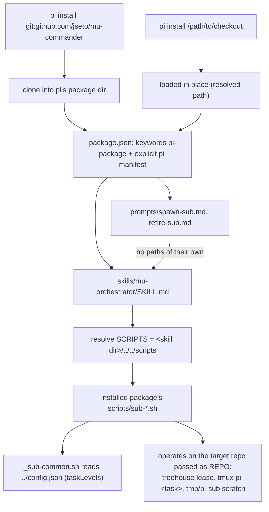

# Design: mu-commander as an installable pi package

## Summary

Give the repository a root `package.json` so that

```bash
pi install git:github.com/jseto/mu-commander
```

installs it as a pi package (keyword `pi-package` → gallery-eligible), and
ship the orchestrator know-how of `AGENTS.md` as pi resources that resolve
**inside the installed package**:

- **`skills/mu-orchestrator/SKILL.md`** — the distilled orchestrator
  pattern: topology, helper table, verified-send rule, lifecycle
  (spawn → monitor → report → land → retire), naming, env overrides. It is
  the package's *path authority*: pi injects the skill's location, so the
  skill resolves the helpers as `../../scripts` from its own directory —
  correct in the checkout and in any installed clone alike.
- **`prompts/spawn-sub.md`, `prompts/retire-sub.md`** — thin `/`-command
  templates for the two lifecycle ends with the most procedure. An expanded
  template never learns its own load path, so templates deliberately carry
  *no* script paths; they tell the model to follow the `mu-orchestrator`
  skill first, which owns path resolution.
- **`scripts/` + `config.json`** — plain payload in every clone (not pi
  resource types). `_sub-common.sh` already resolves the task-level config
  as `$_SUB_COMMON_DIR/../config.json` (next to `scripts/`), so an installed
  package ships working defaults; `SUB_LEVELS_CONFIG` still overrides.

### What ships as pi resources and what does not

| Candidate | Verdict | Why |
|---|---|---|
| `mu-orchestrator` skill (distilled from AGENTS.md) | **ship** | The brief's leading candidate: teaches any pi session to drive the `sub-*` helpers; skills may carry supporting files and know their own directory |
| `spawn-sub` / `retire-sub` prompt templates | **ship** | The two ends of the child lifecycle with the most procedure; natural `/` commands for the user; defer paths to the skill |
| `scripts/*.sh` as package payload | **ship as payload** (not a resource type) | Reachable from the skill via `../../scripts`; helpers take the target repo as an argument, so they work from any install location |
| `config.json` as package payload | **ship as payload** | Resolved by `_sub-common.sh` relative to `scripts/`; carries the shipped `taskLevels` defaults |
| `AGENTS.md` verbatim | **no** | Checkout-specific (this machine's `SCRIPTS` path, tmux/treehouse state, main-session conventions); pi already loads a checkout's AGENTS.md as context — shipping it as content would duplicate and drift. The skill distills the transferable part |
| `extensions/` | **no** | No executable integration point is needed: the helpers are CLIs the model runs on demand. An extension would execute in every session and add review/dependency surface for zero capability |
| `themes/` | **no** | Nothing themable in a shell-script project |
| `tests/`, `specs/`, `mu`, `.pi/` | **no** | Repo/dev artifacts; they exist in the clone (harmless) but are not declared resources |
| More templates (`sub-status`, `sub-changes`, …) | **no** | One-liners better served by the skill's helper table; every extra template is another `/` command to review |

### Manifest choice: explicit `pi` over conventional dirs

Both work; the explicit manifest wins because it *filters*: only
`./skills` and `./prompts/*.md` are ever discovered, so a future
`extensions/`, `themes/`, or scratch Markdown at the root cannot silently
load into users' sessions, and the declaration documents the surface area.
Conventional discovery would otherwise infer everything present today and
anything added tomorrow.

## Stated / deduced / assumed

- **Stated** (brief): root `package.json` with `keywords: ["pi-package"]`,
  name, description, repository; decide which resources ship; script
  references must resolve inside the installed package (never a hardcoded
  repo path); no regressions to `scripts/`, `tests/`, `mu`, `config.json`,
  AGENTS.md conventions, `sub-spawn.sh`, or the worktree setup; prove a
  local install (`pi install ./<dir>` → `pi list` → resources visible) and
  document/verify the git path (against the pushed branch ref if feasible);
  README with the install command; full flow (atomic specs → implement →
  audit) with tests under `tests/`.
- **Deduced** (verified against the installed pi 0.87.1 docs + a scratch
  prototype run):
  - pi identifies local packages by resolved path, git packages by repo
    URL, and reports each command's `sourceInfo.origin == "package"` with a
    `baseDir` through `get_commands` in `--mode rpc` — a hermetic,
    model-free way to assert "resources visible/loaded" (no API calls);
  - `PI_CODING_AGENT_DIR` (environment-variables.md) relocates the agent
    directory, so install tests never touch the real `~/.pi/agent`;
  - project resources load from `.pi/*` and `.agents/skills`, so a root
    `skills/`/`prompts/` in this checkout is *not* double-discovered as
    project resources — no name collisions, no behavior change in-repo;
  - skill paths are injected into the model's context ("Pi tells the model
    where the skill lives"), prompt templates get no such guarantee — hence
    the skill-is-the-path-authority split;
  - `_sub-common.sh` anchors `config.json` at
    `$_SUB_COMMON_DIR/../config.json`, so the packaged config resolves
    inside the installed package with no code change;
  - the treehouse `post_create` hook picks the JS installer by lockfile: a
    bare `package.json` would make `npm install` *generate* a lockfile in
    every fresh worktree (untracked dirt), and its `js_install` writes a
    marker into `node_modules/` (also untracked dirt unless ignored).
- **Assumed**: npm publishing is *eligibility only* (keyword present), not
  an actual publish — no npm ownership decision is required for a git
  install; the repository has no LICENSE file, so `package.json` names no
  license (choosing one is an ownership decision for the user).
- **Open questions**: none requiring the user; the branch-ref git install
  covers the post-merge path as far as it can be covered before merging.

## Entities

- **`package.json`** (new, repo root) — identity
  (`name: mu-commander`, `version: 0.1.0`, `description`, `keywords:
  ["pi-package"]`, `repository: git+https://github.com/jseto/mu-commander.git`)
  plus the explicit manifest:
  `"pi": {"skills": ["./skills"], "prompts": ["./prompts/*.md"]}`. No
  `dependencies` (nothing to install).
- **`package-lock.json`** (new, repo root, committed) — locks the empty
  dependency set so the worktree-setup hook takes its `npm ci` path
  (deterministic, never rewrites the lockfile) instead of the bare
  `package.json` path whose `npm install` would generate one.
- **`.gitignore`** (modified) — add `node_modules/`: the hook's `js_install`
  writes `node_modules/` + marker even for an empty install; ignored state
  can never make a worktree look dirty.
- **`skills/mu-orchestrator/SKILL.md`** (new) — frontmatter (`name`,
  `description` with routing cues) + distilled orchestrator guidance; the
  `SCRIPTS` resolution rule is `<skill dir>/../../scripts`, stated once and
  used as `"$SCRIPTS/<name>.sh"` everywhere; names only helper files that
  exist in `scripts/`; no absolute checkout paths anywhere.
- **`prompts/spawn-sub.md`** (new) — `/spawn-sub <task> <repo> [brief]
  [--level …]`: load the skill, avoid double-booking, write the brief,
  spawn, report the handles.
- **`prompts/retire-sub.md`** (new) — `/retire-sub <task> <repo>`: merged ⇢
  retire preconditions (squash-merge diff check, uncommitted-work rule,
  `--force` only after checks), then `sub-retire.sh`.
- **`README.md`** (new) — short: what the repo is, the exact GitHub install
  command, what the package provides, `pi list` verification, local-path
  install, `pi update` refresh.
- **`specs/pi-package-install/`** (new) — this design + the feature file.
- **`tests/package-manifest.test.sh`** (new) — one test per scenario
  [REQ-1]…[REQ-7]; hermetic install checks via `PI_CODING_AGENT_DIR` +
  scratch cwd + `pi --mode rpc --no-session --offline` `get_commands`;
  [REQ-5] (git install from the pushed branch) is env-gated behind
  `MU_PKG_GIT_VERIFY=1` because it needs the branch on GitHub, and is
  exercised once manually before the PR.

## Behaviour and data flow



## Proposed changes (files/modules)

| File | Change |
|---|---|
| `package.json` (repo root) | new — identity, `pi-package` keyword, explicit `pi` manifest (skills + prompts only) |
| `package-lock.json` (repo root) | new, committed — empty dependency set, pins the hook to its `npm ci` path |
| `.gitignore` | add `node_modules/` (hook-written install state stays untracked-but-ignored) |
| `skills/mu-orchestrator/SKILL.md` | new — distilled orchestrator skill, package-relative script resolution |
| `prompts/spawn-sub.md` | new — `/spawn-sub` template |
| `prompts/retire-sub.md` | new — `/retire-sub` template |
| `README.md` | new — GitHub install command, package contents, verification |
| `specs/pi-package-install/*` | feature file + this design |
| `tests/package-manifest.test.sh` | behavioural suite, one test per scenario |

No existing script, test, launcher, or AGENTS.md convention changes — the
helpers already take the repo as an argument and resolve `config.json`
relative to themselves.

## Task list

- [x] Deduce atomic requirements from the brief → [REQ-1]…[REQ-7]
- [x] Write the feature file and this design doc
- [x] Write `tests/package-manifest.test.sh` (one test per scenario)
- [x] Implement the package files + skill + templates + README; suite passes
- [x] No-regression gate: every existing `tests/*.test.sh` suite + shellcheck
      on the new test + `bash -n` pass
- [x] Hermetic local install verified (`pi install` → `pi list` →
      `get_commands` shows package resources, offline, no model call)
- [x] Git install from the pushed branch verified (`MU_PKG_GIT_VERIFY=1`)
- [x] Audit per `code-auditor` (findings below)

## Strengths / Weaknesses

- **Strengths**: one clear path authority (the skill) with a rule that is
  invariant under install location; explicit manifest means the package
  can never grow silent resource types; zero changes to tested shell code
  (the no-regression gate is the *existing* suites, unchanged);
  verification is hermetic and model-free (`PI_CODING_AGENT_DIR` +
  `get_commands`), so CI or a test run never spends a token; the
  worktree-setup hazard of a root `package.json` is closed with two
  inert files instead of a hook change.
- **Weaknesses**: the skill must be kept in sync with `AGENTS.md` by hand
  (they will drift — mitigated only by the audit checklist); the git-ref
  test [REQ-5] is env-gated, so a default local run cannot catch a
  remote-only regression (accepted: it needs GitHub state); package
  resources are invisible until the package is installed in a session, so
  in-checkout authors don't see what users get without running the install
  test; no `license` field while the repo has no LICENSE (deferred to the
  user, noted in the report).

## Code audit (independent pass)

Audited per the `code-auditor` skill: feature file and shipped sources read
from disk, conversational rationale disregarded.

- **Overview**: the package is data, not code — its correctness surface is
  (a) the manifest declaring exactly what ships, (b) one relative-path rule
  anchored at the skill, (c) hermetic verification. The tests cross exactly
  those three seams (`get_commands` output, file/path scans) instead of
  implementation details, which is the right shallowness for a packaging
  change. Step 2 found no major architectural improvements, so nothing was
  refactored; the suite was re-run green after the audit.
- **Files**: `package.json`, `skills/mu-orchestrator/SKILL.md`,
  `prompts/spawn-sub.md`, `prompts/retire-sub.md`, `README.md`,
  `tests/package-manifest.test.sh`.
- **Problem / Solution / Benefits**: no architectural friction detected —
  the package adds no runtime code path, and every existing module
  (helpers, hook, launcher, AGENTS.md conventions) is untouched by
  construction; the no-regression evidence is the unchanged existing
  suites, all green.
- **Less valuable improvements** (noted, deliberately not done):
  1. `[REQ-4]`/`[REQ-5]` duplicate the install → `pi list` →
     `get_commands` → assert sequence; an
     `assert_pkg_resources <cmds> <base-dir>` helper would localize the
     package-resource contract. *Worth exploring* only if a third install
     path appears — today the duplication is ~15 local lines per test and
     each failure message names its own install path, which a shared
     helper would blur.
  2. The skill's helper table must be kept in sync with `AGENTS.md` and
     `scripts/` by hand (the `[REQ-3]` token check catches dead script
     names but not missing new helpers). *Speculative*: a generated table
     adds a build step to a script-only repo, and the table is curated —
     `worktree-setup.sh` is deliberately absent from it.
  3. Splitting the skill into spawn/monitor/retire sub-skills would shrink
     per-load context. *Worth exploring* only if it grows past ~200 lines;
     it fits one load comfortably today.
- **Recommendation strength**: Speculative for all three; audit verdict —
  no architectural friction, ship it.
