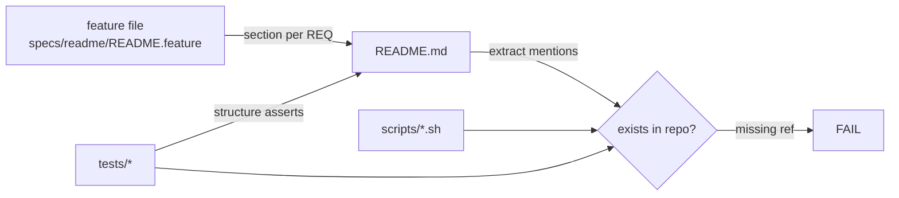

# Design: README.md for mu-commander

## Summary

One new artifact — `README.md` at the repository root — plus a hermetic
verification test `tests/readme.test.sh` that keeps the README honest: every
repository path, script, test file, and environment variable it mentions must
exist in the repository, and the structural sections ([REQ-1]…[REQ-9]) must
be present. No product code changes.

## Entities

| Entity | Role |
|---|---|
| `README.md` | The deliverable. Sections: title + one-paragraph description, What is it, Install, How to use, Mu usage for self-configuration, Dependencies. |
| `specs/readme/README.feature` | Atomic requirements, one Scenario per `[REQ-n]`. |
| `tests/readme.test.sh` | Bash test, repo conventions (`fail`/`run`, `[REQ-n]` assertion blocks), exit 0 = green. Asserts structure and *referential honesty* (no fabricated commands/files/vars). |

## Verification seams

The test derives its truth from the repository, not from README wording:

- **Structure**: one assertion block per Gherkin scenario, grep-able headings
  (`## What is it`, `## Install`, `## How to use`, `## Mu usage for
  self-configuration`, `## Dependencies`, license absence).
  The 2026 simplification pass replaced the earlier section list
  (Features/Installation/Usage/Configuration/Development); [REQ-2] through
  [REQ-7] were re-pointed or restructured to the new headings only — the
  referential-honesty checks are unchanged.
- **Referential honesty**: every `scripts/<name>.sh` and `tests/<name>`
  token in the README must exist; every `SUB_*`/`DEV_BRANCH`/`MAIN_*`/
  `PI_*`/`SCRATCH_DIR` variable named must appear in `scripts/`.

## Proposed changes

| File | Change |
|---|---|
| `README.md` | new (deliverable) |
| `tests/readme.test.sh` | new (verification) |
| `specs/readme/README.feature` | new (this flow) |
| `specs/readme/README-design.md` | new (this document) |
| existing code/config | none |

## Implementation plan

1. Verify every claim against `AGENTS.md`, `config.json`, `mu`,
   `scripts/*.sh` (usage lines, `need` dependency lists, env defaults in
   `_sub-common.sh`) and `tests/` file names.
2. Write `README.md` — short sections, fenced commands copied from actual
   usage strings.
3. Write `tests/readme.test.sh`; run it and the full suite.

## Best practices / decisions

- **Strengths**: the test decouples wording freedom from truthfulness — the
  README can be reworded freely, but a renamed script or invented env var
  fails the suite; cheap to maintain.
- **Weaknesses**: prose semantics (a description that is technically true
  but misleading) are not machine-checkable; the audit step covers that by
  reading the README against the repo.
- **Left out deliberately**: License section (no LICENSE file), badges,
  Contributing/Changelog stubs, any command not observed in the scripts.

## Audit notes

Independent audit (code-auditor pass, read from disk: `specs/readme/README.feature`
+ `README.md`; design doc excluded). Applied findings directly — all were
unstaged docs/test edits — then re-ran the suite: 13/13 green.

- **Overview**: structural requirements ([REQ-1]…[REQ-9]) were satisfied;
  the friction was in *truthfulness of prose*, the one thing grep-checking
  cannot fully cover. Four claims were weaker than the repo warrants.
- **Files**: `README.md` (fixes), `tests/readme.test.sh` (unchanged in audit).
- **Problems found & fixed**:
  1. Dependencies were introduced as "checked with `need …"` — false for
     `pi` and `gh`; replaced with accurate wording (up-front `need` list,
     `mu` exit 127, `gh` degrading to `unknown`).
  2. `(v2.3.0+)` minimum-version claim on treehouse was extrapolated from
     AGENTS.md's "v2.3.0" — dropped.
  3. The config snippet duplicated `fallbackModel`/`fallbackThinking`
     *values*, conflicting with AGENTS.md making `config.json` the single
     source of truth — replaced with `<…>` placeholders + pointer.
  4. Usage examples mixed relative `scripts/…` with `"$SCRIPTS/…"` after
     defining `SCRIPTS`; normalized. Also completed the coreutils list
     (`date`, `sha256sum`, `tar`, `mktemp`), corrected `MAIN_PANE`'s default
     to auto/empty, and named both test-file patterns.
- **Benefits**: README now cannot drift on structure (test) and no longer
  asserts anything a fresh reader could prove wrong against the scripts.
- **Before / After**: claims sourced from *memory of the pattern* → claims
  sourced from `need` lines, usage strings, and AGENTS.md's own rules.
- **Recommendation strength**: **Worth exploring** — remaining gap (prose
  semantics) is covered by this audit; a future improvement could pin the
  config-snippet keys against `config.json` in `tests/readme.test.sh`.
