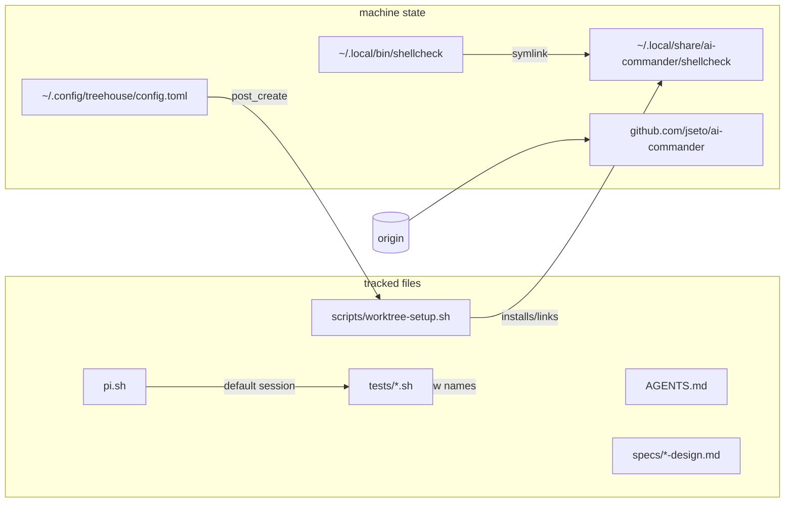

# Design: rename the project identifier to ai-commander

## Stated / deduced / assumed

- **Stated (brief):** rename the hyphenated identifier `ai-orchestrator` and
  its derivations everywhere in tracked files; keep generic
  "orchestrator"/"orchestration" prose; two machine-level fixes
  (treehouse hook path, managed shellcheck directory); GitHub repo rename +
  origin update before push/PR; full test suite green; standard child flow.
- **Deduced:** the `~/.local/bin/shellcheck` symlink points into the managed
  directory, so moving the directory without re-pointing the symlink would
  leave a dangling link and a broken `command -v shellcheck`; the move must
  include re-pointing the symlink for [REQ-4] to hold.
- **Assumed:** no other machine state outside the repo references the old
  identifier in a way this task must fix (brief enumerates exactly two fixes).
- **Open questions:** none — the brief is explicit; no user input required
  (the interactive `question` tool is not available in this session).

## Entities

| Entity | Change |
|---|---|
| Tracked identifier `ai-orchestrator` | → `ai-commander` (AGENTS.md ×2, scripts/worktree-setup.sh, specs ×3) |
| `pi.sh` default session | `local-pi-ai-orchestrator` → `local-pi-ai-commander` |
| Test assertions | tests/test-pi-sh.sh (session name ×3), tests/worktree-setup.test.sh (managed path) |
| New test | tests/rename-project.test.sh — one assertion block per [REQ-1]/[REQ-4]/[REQ-5]/[REQ-6]/[REQ-7] |
| `~/.config/treehouse/config.toml` | post_create hook path → ai-commander checkout (machine, outside repo) |
| `~/.local/share/ai-orchestrator/shellcheck` | `mv` → `~/.local/share/ai-commander/shellcheck` + re-point `~/.local/bin/shellcheck` (machine) |
| GitHub repo / origin | `gh repo rename ai-commander -R jseto/ai-orchestrator` + `git remote set-url origin`; later renamed to `jseto/mu-commander` by a follow-up task — [REQ-7] pins that current name |

## Seams

## Plan (TDD order)

1. Write `tests/rename-project.test.sh` and update the assertions in
   `tests/test-pi-sh.sh` / `tests/worktree-setup.test.sh` first → suite RED
   (they assert the new names while code still has the old ones).
2. Apply the tracked-file renames → REQ-1/2/3 go green.
3. Machine fixes (treehouse hook, shellcheck move + symlink re-point) →
   REQ-4/5 green.
4. GitHub rename + origin URL → REQ-7 green; then push and open the PR.
5. Full suite green, commit, report.

`tests/rename-project.test.sh` guards machine-specific assertions: they
skip (not fail) when the config/managed dir/remote does not exist, so the
suite stays runnable on machines without this task's machine state.

## Best practices / decisions

- **grep over `git ls-files`** for [REQ-1]: only tracked files count; gitignored
  scratch (`tmp/`) and history stay untouched by design. The rename's own
  spec/test documents are exempt from the grep (pathspec excludes): they must
  literally name the old identifier to define the rename — a stale-reference
  check that flagged its own definition would be self-defeating.
- **Guarded machine assertions** keep the suite hermetic while still failing
  loudly on *this* machine when a fix regresses (e.g. hook pointing back at
  the old directory).
- **Symlink re-point instead of re-install**: preserves the pinned,
  checksummed binary — no network, no re-download, idempotency check passes.
- **Weakness:** the suite cannot prove the remote GitHub repo name itself
  (only the configured origin URL); the `gh repo rename` step is verified
  once at execution time and recorded in the report.

## Out of scope (explicitly preserved)

`.git`, gitignored scratch, historical records (`logs/conversations/`,
`~/.pi/agent/sessions/`, `.pi/`), and every prose use of
"orchestrator"/"orchestration" describing the role rather than the project.

## Code audit (post-implementation, code-auditor skill)

- **Overview**: sources re-read from disk (`*.feature` + modified sources,
  design doc excluded from the audit input). The change is a value-only
  substitution along existing seams — no new modules, no behavior change
  beyond the identifier, so no major architectural improvements were
  detected and the audit stopped at step 2. One scenario↔test gap was found
  and fixed: REQ-4's "no re-download" clause now has an automated assertion
  (the test runs `worktree-setup.sh` and requires the "already installed"
  line and the absence of "installing pinned").
- **Files**: `pi.sh:6`, `scripts/worktree-setup.sh:120`, `AGENTS.md:123,240`,
  three `specs/*-design.md` documents, `tests/test-pi-sh.sh`,
  `tests/worktree-setup.test.sh`, new `tests/rename-project.test.sh`.
- **Less valuable improvements (not taken, deliberately)**: splitting the
  machine-state assertions ([REQ-4]/[REQ-5]) into a separate suite runnable
  only on the provisioning host (speculative — they already skip
  gracefully); asserting the GitHub repo *name* rather than the origin URL
  (would add a network dependency to the suite; verified once at execution
  time instead).
- **Tests**: full suite green after the change (9/9 files, including the
  updated assertions and the new rename suite).

### Rebase audit (PR #10 onto current `development`)

- **Conflicts**: `AGENTS.md` auto-merged (development's newer prose plus the
  two identifier paths); `pi.sh`,
  `specs/pi-sh-tmux-wrapper/pi-sh-tmux-wrapper-design.md` and
  `tests/test-pi-sh.sh` were modify/delete conflicts and resolved to
  **deleted** — development dropped `pi.sh` in favour of the `mu.sh`
  launcher (#11/#12), so the branch's edits to those files are obsolete.
- **Verification**: the branch delta vs `development` is exactly the
  identifier substitutions in the surviving files plus this spec/test pair;
  no development content was reverted, no later rename identifier was
  introduced, and the generic "orchestrator"/"orchestration" prose is
  untouched ([REQ-6]).
- **[REQ-2] is historical**: its `pi.sh` default no longer exists on the
  rebased base and its coverage (`tests/test-pi-sh.sh`) was removed by
  development; per the task brief this is "nothing to do".
- **[REQ-7] pinned to the actual repository state**: the GitHub repository
  was renamed again to `jseto/mu-commander` by a follow-up task, so the
  origin assertion (test and feature wording) expects the current name while
  still failing on any `ai-orchestrator` reference.
- No architectural findings; the change remains a value-only substitution
  along existing seams.
