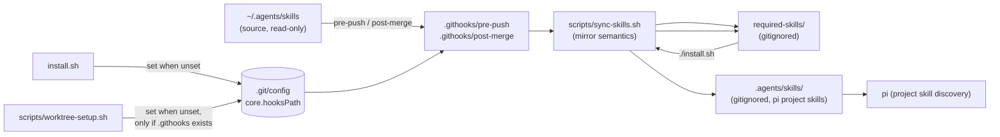

# Design: required-skills sync via git hooks + installer (`skills-sync-hook`)

## Abstract

One new sync module (`scripts/sync-skills.sh`), two thin versioned hooks
(`.githooks/pre-push`, `.githooks/post-merge`), and two small installer
steps (in `install.sh` and `scripts/worktree-setup.sh`). The hooks mirror
`~/.agents/skills` → `<repo>/required-skills/` at push/merge; the installer
mirrors `<repo>/required-skills/` → `<repo>/.agents/skills/` (pi's project
skills location) on every run and idempotently activates the hooks via
`git config core.hooksPath .githooks`. Both skill folders are gitignored
local caches.

## Entities and seams

| Entity | Role |
|---|---|
| `scripts/sync-skills.sh` (new) | The one sync module: `<src> <dst>` → mirror every immediate subdirectory (a skill per the Agent Skills spec) into `<dst>`, replacing stale copies and pruning destination-only skills. Never destructive on a missing/empty source (warning, exit 0); only a real copy failure exits 1. Its output (`skills-sync: …`) is the user-facing message in hooks and installer alike. |
| `.githooks/pre-push`, `.githooks/post-merge` (new) | ~8-line wrappers: resolve the worktree root, run `bash scripts/sync-skills.sh "$HOME/.agents/skills" <root>/required-skills`, **always exit 0**. Committed executable (mode 100755). |
| `install.sh` (modified) | Two advisory steps that run on every invocation, including the all-present no-op path: `sync_required_skills` (required-skills → .agents/skills via the shared module) and `activate_githooks` (idempotent `core.hooksPath`). Neither bucket touches the summary; failures only `warn` — the exit status stays tied to PATH dependencies. Seams `MU_SKILLS_SRC` / `MU_SKILLS_DST` relocate the two folders for hermetic tests. |
| `scripts/worktree-setup.sh` (modified) | Same idempotent activation, guarded on `.githooks/` existing — the script is the user-level `post_create` hook of *other* repositories too, and pointing a foreign repo's `core.hooksPath` at a directory it does not have would silently disable its own hooks. Advisory: never sets `rc`. |
| `.gitignore` (modified) | Adds `required-skills/` and `.agents/skills/`. |

## Decisions

| Question | Decision | Why (strengths / weaknesses) |
|---|---|---|
| **Which skills are "required"?** | **All immediate subdirectories of `~/.agents/skills`** (directory-contents copy, no manifest) | The requirement names no list, and a manifest would force *inventing* one — a guess. The source directory is already the user's curated set, so mirroring it is the faithful reading of "the required skills from `~/.agents/skills`"; filtering can be added later *inside* `sync-skills.sh` without touching any caller (+ future-proof, no maintenance burden − a repo that needs a strict subset gets none until a manifest is added). |
| **Gitignore status** | **Both `required-skills/` and `.agents/skills/` are gitignored**; only the machinery is versioned | The flow is inherently per-machine (source = the user's own home). Committing the mirror would import ~18 MB of skill content — including `impeccable`'s platform binary (`scripts/bin/linux-x64/…`) — into git history, and a pre-push sync would otherwise leave a dirty tree (hook-written files can never be part of the push that wrote them) (+ clean tree, no churn, no personal content in the repo − a fresh clone has no skill *content* until the first sync). Fresh-clone story: the machinery (`.githooks/`, `sync-skills.sh`, installer steps) is committed, so hooks activate on `./install.sh` / worktree provisioning; content lands on the first push/merge (or `scripts/sync-skills.sh <src> <dst>` run by hand) and `./install.sh` activates it — documented in README. |
| **Hook activation** | Versioned `.githooks/` + `git config core.hooksPath .githooks`, a **relative** path git resolves against each worktree's top level → one shared config entry activates every linked worktree. Set idempotently by `install.sh` (fresh clones: README tells users to run it) and `scripts/worktree-setup.sh` (pool worktrees), guarded on `.githooks/` existing and **never overwriting a foreign value** (warn + manual hint instead) (+ survives `.git/hooks` being unversioned; non-destructive − two activators are redundant once set; a custom `core.hooksPath` means this repo's hooks stay off until the user decides) |
| **Copy semantics** | Mirror: per-skill `rm -rf` + `cp -a` (stale files inside a skill cannot survive), then prune destination skills the source dropped; destination non-directory files are left alone; **missing/empty source → warning + exit 0 with the destination untouched** (an empty home can never wipe the cache) (+ convergent, destructive cases bounded to same-named skills − a failed mid-run copy can leave a skill partially copied; harmless for caches, re-synced next run) |
| **Failure policy** | Hooks `exit 0` unconditionally (sync problems print `skills-sync: …` on stderr; a push/merge must never be blocked); `sync-skills.sh` exits 1 only on real copy failures so tests/callers can tell success from failure; the installer degrades every problem to `warn` — its exit status stays "all dependencies resolve on PATH" (+ never user-hostile, contract intact − automation must read output, not status, to learn a sync failed) |

## Implementation plan

1. `scripts/sync-skills.sh` — arg validation, collect source skills (a
   directory with none ⇒ warn + 0), copy loop, prune loop, result line.
2. `.githooks/pre-push` + `.githooks/post-merge` — thin wrappers, same
   body, hook-specific header comment; both end in `exit 0`.
3. `install.sh` — `sync_required_skills` + `activate_githooks` functions;
   call the skills step right after the inventory line and the activation
   step on **both** exit paths (all-present no-op and the install path —
   after the installs so a freshly installed `git` is available).
4. `scripts/worktree-setup.sh` — guarded activation block (see Entities).
5. `.gitignore` — the two cache folders.
6. README — new `Install → 3. Skills and git hooks` subsection (renumbering
   the later subsections), describing the push/merge → install flow, the
   gitignored caches, and the manual sync command.
7. Tests — `tests/skills-sync.test.sh` (REQ-1…10 with real git in a
   sandbox: local bare origin, fake `HOME`, logging `git` stub for the
   installer runs, sandbox *repository* for the `core.hooksPath` assertions
   so real `git config` never touches this checkout), plus one block each
   in `tests/worktree-setup.test.sh` (REQ-11/12) and the hermetic
   `MU_SKILLS_*` forwarding in `tests/install.test.sh`.

## Testing seams

- `MU_SKILLS_SRC` / `MU_SKILLS_DST` (install.sh): relocate the two folders
  so no test writes the real checkout's caches. Test-only knobs, not
  documented in README's env table (they are not user-facing).
- Sandbox git in `tests/skills-sync.test.sh`: real `git` for the hook and
  activation scenarios (bare local origin, fake `HOME`); a logging stub for
  the `git config` reads/writes only where a stubbed value
  (`STUB_GIT_HOOKSPATH`) must be simulated.

## Best practices taken

- **One deep module**: both hooks and both activators reuse
  `sync-skills.sh`; no copy logic exists twice.
- **Advisory steps**: skills/hooks can fail without affecting any exit
  contract (push, merge, installer, worktree setup).
- **Non-destructive by default**: foreign `core.hooksPath`, missing or
  empty sources, and pre-existing destination content are all preserved.
- **Traceability**: every observable behaviour is one `[REQ-n]` scenario in
  `skills-sync-hook.feature`, asserted one-to-one in the test suites.

## Audit (code-auditor pass)

Independent re-read of the feature file and every modified source file on
disk (design doc excluded), evaluated against `codebase-design`:

- **`scripts/sync-skills.sh` is the deep module of the feature**: a
  two-argument interface (`<src> <dst>` + 0/1/2 exit contract) hides skill
  discovery, mirror semantics, and the never-destructive guard. Four call
  sites (pre-push, post-merge, installer, manual README invocation) and all
  `[REQ-3..8]` tests cross the same seam — no test reaches past it.
- **Adapters are thin where a real seam exists**: two git lifecycle events
  (push, merge) vary over one implementation; the installer and
  worktree-setup vary only in logging convention and root resolution, both
  callers reduced to ~10 guarded lines.
- **Accepted duplications** (reported, deliberately not extracted):
  the `core.hooksPath` activation policy exists twice (`install.sh`
  `activate_githooks` vs the `worktree-setup.sh` block) — a shared script
  would have to serve two incompatible logging contracts (installer
  `info`/`warn` on stdout/stderr vs `[worktree-setup] …` exclusively on
  stderr, stdout staying clean for `get --lease`) and two roots
  (`-C $REPO_ROOT` vs cwd); rated **Worth exploring** only if a third
  activator appears. The two hook files duplicate a 6-line body — git's
  hook seam requires separate files, a shared library is indirection for
  six lines, and a symlink pair would break on checkouts without symlink
  support; rated **Speculative**.
- **Gaps closed during the audit**: the installer's "could not set
  core.hooksPath" warn branch had no test — added as
  `[supp] activation failure warns, status 0` in `tests/skills-sync.test.sh`.
- **No architectural changes were required**; Step 3 of the audit produced
  no refactor, Step 4 re-ran the full suite green (13 suites).

## Weaknesses / follow-ups

- `gitignore`d content means a fresh clone starts with no skills until the
  first sync (documented; a committed manifest+content flow would reverse
  this but conflicts with the 18 MB binary in the source set).
- Two thin hook files duplicate the same 6-line body (kept separate on
  purpose: no shared indirection, each hook readable standalone; a symlink
  pair would break on checkouts without symlink support).
- The activation is not a *dependency*, so a foreign `core.hooksPath`
  exits 0 with a warning rather than 1 — deliberate, but automation must
  grep output to notice it.
